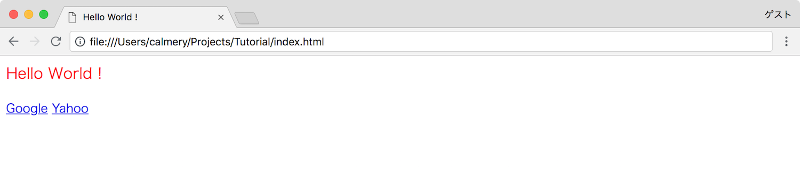

# レイアウト

CSS は HTML のレイアウトを指定するために使用されます．

### 準備

HTML のチュートリアルで使用した HTML ファイルを引き続き使用します．現時点の内容は以下の通りです．

```html
<html>
  <head>
    <title>Hello World !</title>
  </head>

  <body>
    <p>Hello World !</p>
    <a href="https://www.google.com">Google</a>
    <a href="https://www.yahoo.co.jp">Yahoo</a>
  </body>
</html>
```

CSS を新たに適用するため Atom で新規ファイルを作成します．Atom の左側にあるファイルの一覧を右クリックし「New File」をクリックします．ファイル名の入力が求められるので `layout.css` と入力します．さらに HTML の `head` タグに以下のタグを追加します．

```html
<link rel="stylesheet" href="layout.css">
```

これで CSS を使用する準備が完了しました．

### 指定する

作成した `layout.css` の内容を以下のように変更し，保存します．

```css
p {
  color: red;
  font-size: 20px;
}
```

実行すると以下のように表示されます．



文字色が赤色に変更され，文字のサイズが少し大きくなっていることがわかります．

### 解説

まずこの `p` の部分，これは HTML で指定したタグの名前の部分に対応しています．HTML の中にある以下の部分に対応しているということです．

```html
<p>Hello World !</p>
```

次に `{` と `}` を使用してその中にレイアウトを構成するオプションを入れていきます．オプションは `name: value;` のような形で指定されます．`name` がそのオプション名，`:` で区切り，`value` がそのオプションの値になります．最後に `;` を忘れないように注意する必要があります．このオプションは複数記述することが可能です．

##### `id` や `class` を使用する

HTML のタグに `id` というオプションや，`class` というオプションを追加することで特定の要素にのみ CSS を適用することが可能です．
