# Web サイトを公開する

ここでは GitHub を使用して自身の Web サイトを公開します．

### 新規リポジトリを作成する

まずは Web サイトのソースコードを管理するためのリポジトリを作成します．[GitHub](https://github.com) を開き，右上の「＋」をクリックし「New repository」をクリックします．

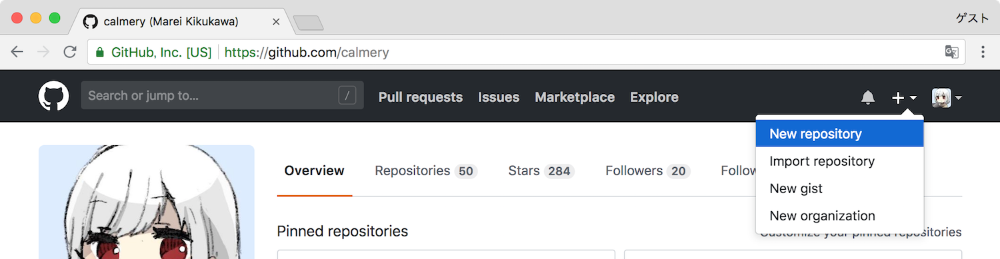

次に「Repository name」に `username.github.io` と入力します．`username` は「Owner」の部分に表示されているものです．

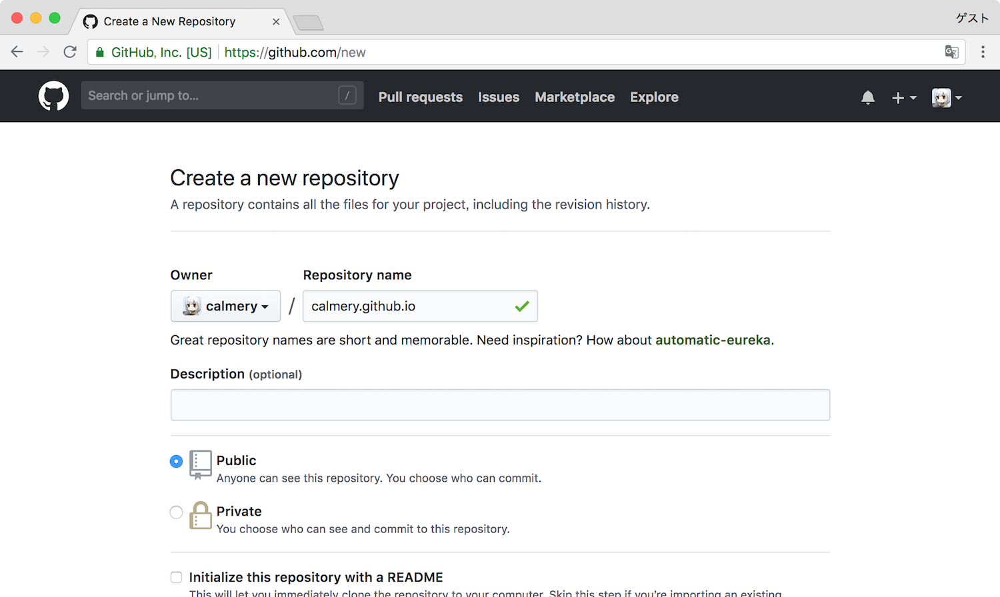

入力が完了したら下までスクロールし，「Create repository」をクリックします．

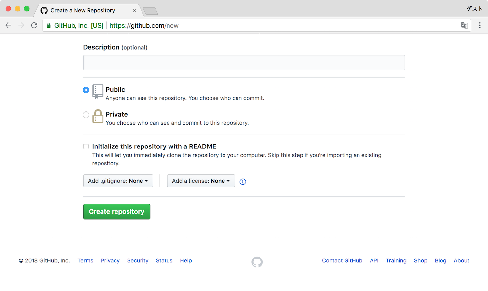

これでリポジトリを作成することができました．

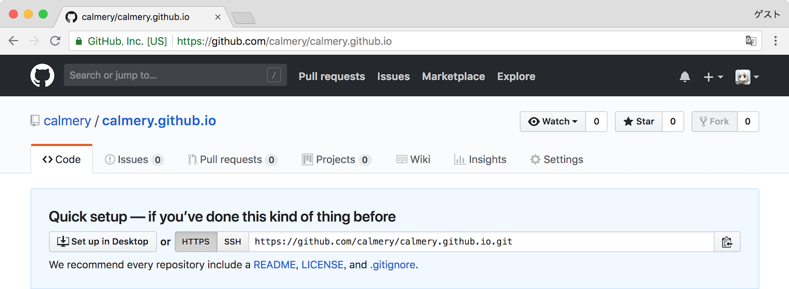

このリポジトリを使用して Web サイトのソースコードの管理から公開までを行います．

### クローンする

作成したリポジトリを手元のコンピュータにクローンします．イメージとしてはダウンロードの近いものです．「Quick setup」にある URL をコピーします．

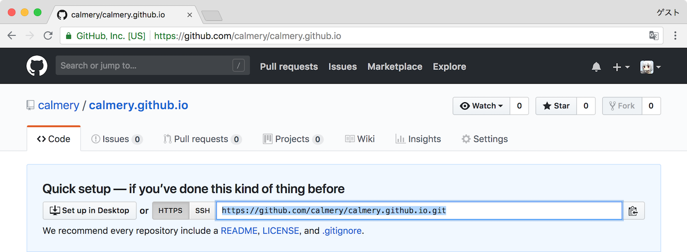

ターミナル（コマンドプロンプト）を開きます．適当なフォルダに移動した後に次のコマンドを実行します．`https://github.com/username/username.github.io.git` の部分には「Quick setup」でコピーした URL を使用します．

```bash
$ git clone https://github.com/username/username.github.io.git
```

> ##### `Command not found: $` と表示される
先頭の `$` はターミナルの入力待機状態を表します．この `$` の入力は必要ありません．その次のコマンドから，この場合は `git` から入力を始めます．

次のような結果が得られれば成功です．

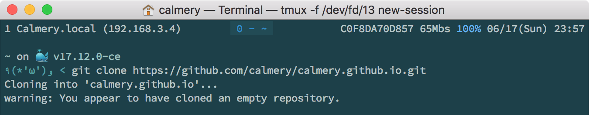

### エディタで開く

これで自身のコンピュータ上に作成したリポジトリをクローンすることができました．次にこのリポジトリにファイルを追加していくためにエディタで開きます．次のコマンドを入力します．

> `username.github.io` の `username` 部分は自身の使用している名前を指定します．

リポジトリをクローンした際にそのリポジトリの名前に対応したフォルダが作成されるのでターミナル（コマンドプロンプト）上でそのフォルダに移動するために `cd` というコマンドを使用します．

```bash
$ cd username.github.io
```

`cd` コマンドを実行してフォルダへの移動が完了した後，次のコマンドを実行します．

```bash
$ atom .
```

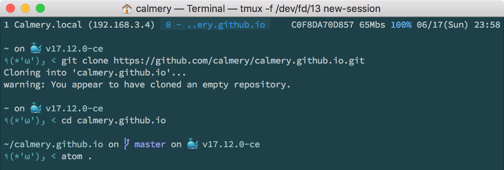

このコマンドを実行すると現在ターミナル（コマンドプロンプト）で移動したフォルダを開いた状態の Atom が立ち上がります．
> ターミナル（コマンドプロンプト）からではなく Atom を直接立ち上げて，Atom のメニューにある「File」の「Open...」から対象のフォルダ，今回は `username.github.io` を選択することで開くこともできます．

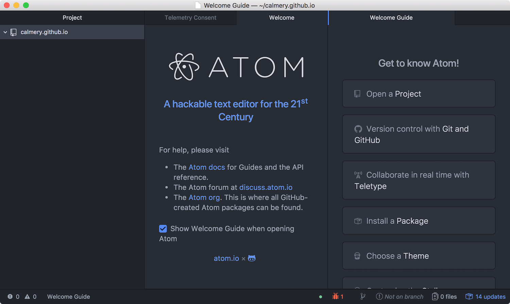

### ファイルを作成する

Web サイトのトップページとなる `index.html` というファイルを作成し，記述していきます．Atom の左側のメニューを右クリックして「New File」を選択します．次に `index.html` と入力し，ファイルを作成します．

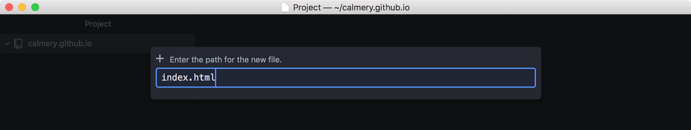

ファイルの作成が完了したら，次の内容を `index.html` に記述します．

```html
<html>

  <head>
    <title>Hello World !</title>
  </head>

  <body>
    <p>Hello World !</p>
  </body>

</html>
```

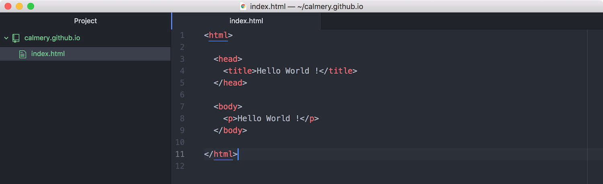

これでファイルを作成し，内容を記述することができました．

### 変更を適用する

[GitHub](https://github.com/) は `Git` というバージョン管理ツールのインターネット上で利用できるようにしたサービスです．この `Git` というバージョン管理ツールはソースコードの差分管理を行います．この `Git` ですが，ファイルを編集した段階ではその差分管理は行われません．適度に変更を行なった後は自身でその変更を `Git` に知らせる必要があります．次のコマンドをターミナル（コマンドプロンプト）上で実行し，変更を `Git` に通達します．

```bash
$ git add .
$ git commit -m "First commit"
$ git push
```

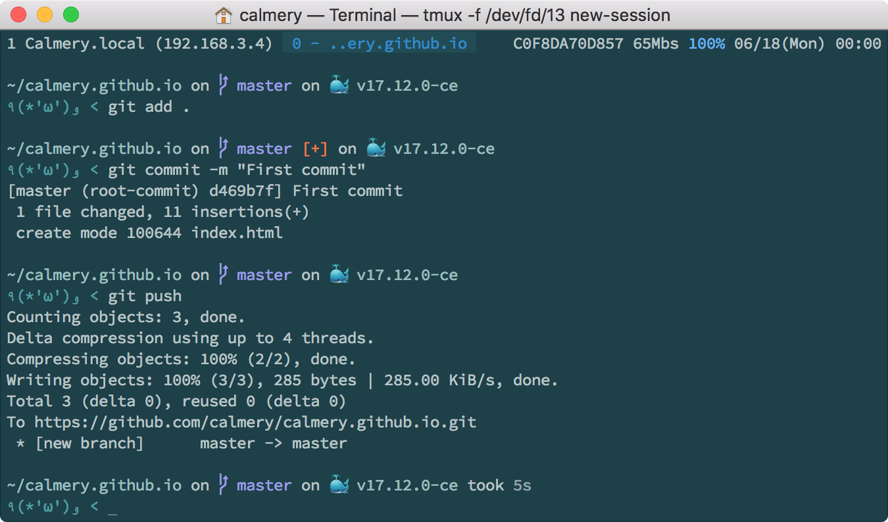

ここでは 3 つのコマンドを入力しました．まず `git add .` では `Git` に変更を通達するファイルの一覧を作成しています．次に `git commit -m "First commit"` では行なった変更に `First commit` というメッセージをつけて `Git` にその変更の内容を通達しています．最後に `git push` で行なった変更を [GitHub](https://github.com/) と同期します．

> `First commit` の部分は好きなメッセージを入力することができます．一般的には変更した内容について記述します．

### 変更の適用を確認する

[GitHub](https://github.com/) を開き，リポジトリの内容が更新されていることを確認します．

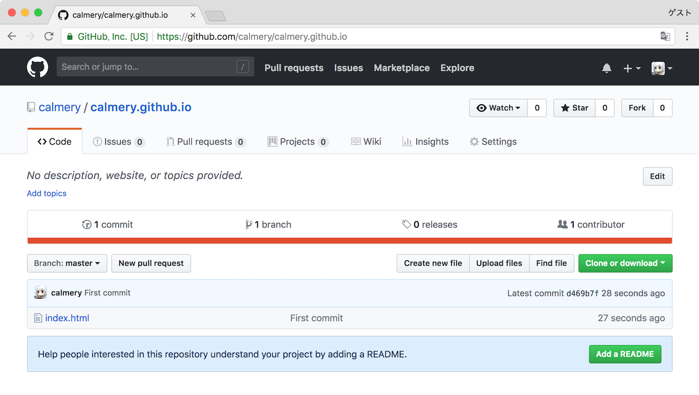

リポジトリを開くと `index.html` が追加されていることがわかります．

### 公開する

[GitHub](https://github.com/) は Web サイトを公開するためのサービスを自社で持っており，リポジトリの内容はファイルの種類によっては自動で公開されます．`https://username.github.io/` を開きます．`username` は自身の使用している名前に置き換えてください．

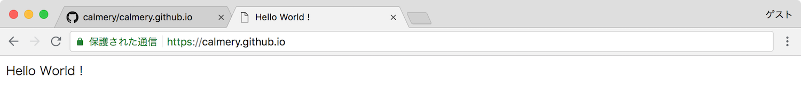

公開されていることを確認できました．この URL を知らせることで誰でもこの Web サイトを見ることができます．

### さらに編集する

公開は完了しましたが，まだ見た目，また動きの追加ができていません．次にその見た目，動きを追加していきます．

> ##### 同期せずに変更を確認する
これからいくつかの変更を加えていきますが，正常に動作しているか確認するために毎回先ほどの 3 つのコマンドを入力するのは大変です．Atom の左のファイル一覧を右クリックして「Show in Finder」をクリックすること（Windows の場合，文言が異なります）でファイルの一覧を開くことができます．ファイルの一覧から `index.html` を Google Chrome などのブラウザで開くことで変更を確認しつつ作業を進めることができます．

##### CSS を使用して見た目を整える

CSS を使用して文字サイズ，文字色の変更を行います．新たに `layout.css` を作成します．

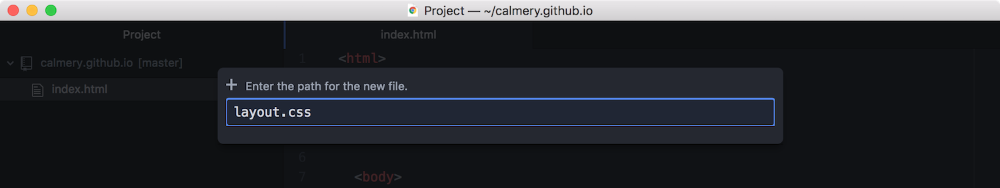

`layout.css` を次のように記述します．

```css
p {
  color: blue;
  font-size: 20px;
}
```

次に `index.html` の内容を変更します．

```html
<html>

  <head>
    <title>Hello World !</title>
    <link rel="stylesheet" href="layout.css">
  </head>

  <body>
    <p>Hello World !</p>
  </body>

</html>
```

保存が完了したら，先ほどと同様にターミナル（コマンドプロンプト）上で以下のコマンドを入力します．今回は `layout.css` を追加したという変更を加えたため，前回 `First commit` というメッセージを指定した部分を `Add layout.css` としました．

```bash
$ git add .
$ git commit -m "Add layout.css"
$ git push
```

[GitHub](https://github.com/) を開き，リポジトリの内容が更新されていることを確認します．

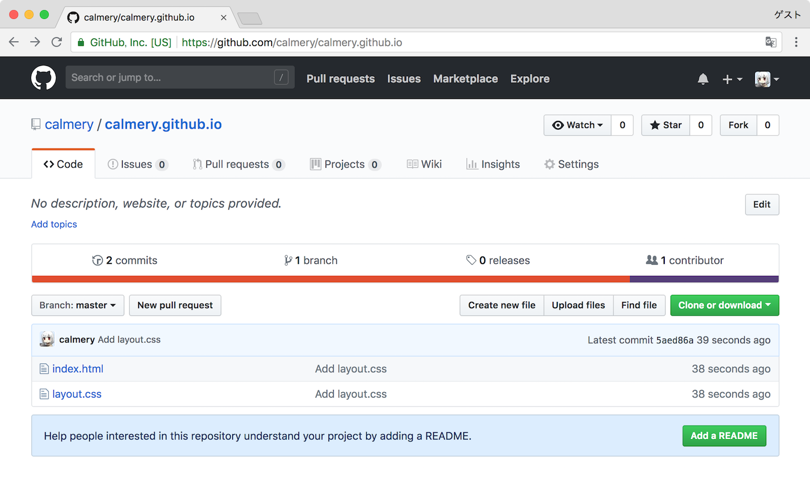

`layout.css` が追加されていることが確認できました．`https://username.github.io/` を開きます．`username` は自身の使用している名前に置き換えてください．

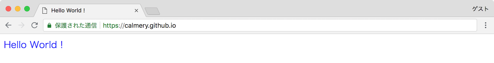

文字色，文字のサイズが変更されていることを確認できました．

> ##### 文字色，文字サイズが変わらない
何度か更新する，また時間を置いて再度開くと変更が適用されます．

##### JavaScript を使用して動きを追加する

JavaScript を使用して Web サイトに動くを追加することができます．今回は簡単なアラートを表示するようにします．新たに `main.js` を作成します．

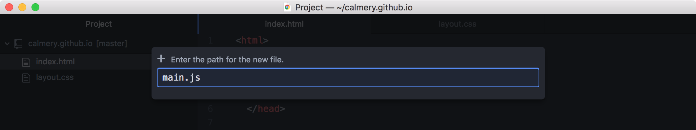

`main.js` を次のように記述します．

```javascript
const message = 'Hello World !'

alert(message)
```

次に `index.html` の内容を変更します．

```html
<html>

  <head>
    <title>Hello World !</title>
    <link rel="stylesheet" href="layout.css">
    <script src="main.js"></script>
  </head>

  <body>
    <p>Hello World !</p>
  </body>

</html>
```

保存が完了したら，先ほどと同様にターミナル（コマンドプロンプト）上で以下のコマンドを入力します．今回は `main.js` を追加したという変更を加えたため，前回 `First commit` と `Add layout.css` というメッセージを指定した部分を `Add main.js` としました．

```bash
$ git add .
$ git commit -m "Add main.js"
$ git push
```

[GitHub](https://github.com/) を開き，リポジトリの内容が更新されていることを確認します．

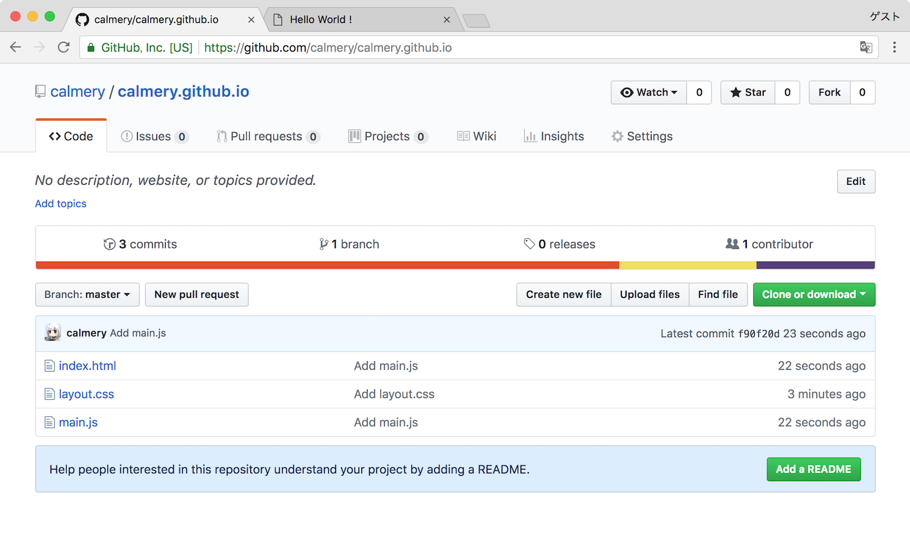

`main.js` が追加されていることが確認できました．`https://username.github.io/` を開きます．

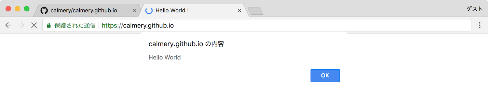

アラートが表示されることを確認できました．

### 変更履歴を確認する

[GitHub](https://github.com/) でリポジトリを開きます．`3 commits` という部分をクリックするとこれまでの変更履歴を見ることができます．この 3 という数字はコミットを行うたびに増えていきます．コミットは `git commit -m "First commit"` のようなコマンドを実行したタイミングで行われます．

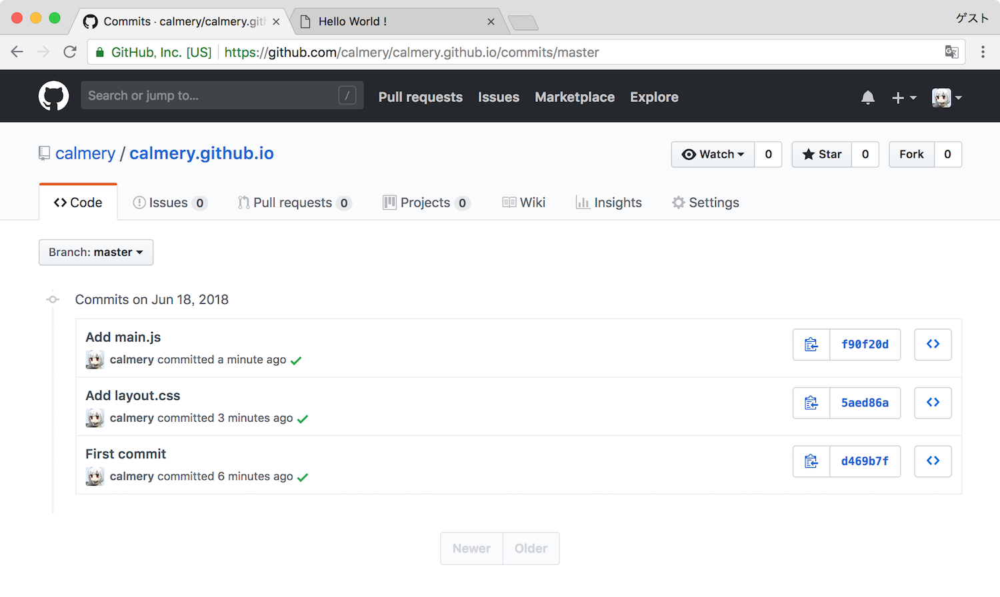

変更の履歴を確認することができました．
