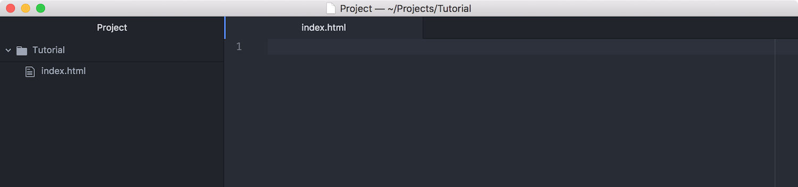
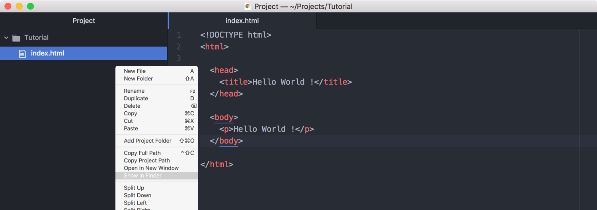

# Hello World !

[Atom](https://atom.io/) を開きます．


### ファイルを作成する

[Atom](https://atom.io/) を開いた際に自動で新規ファイルが作成されるので `index.html` という名前で保存します．保存する場所はどこでも良いですが，今回は `Tutorial` というフォルダを作成しており，その中に保存しています．


### ファイル一覧を表示する

保存が完了すると左側にファイルの一覧が表示されるようになります．フォルダを直接 [Atom](https://atom.io/) で開いた場合にも表示されます．



### 編集する

作成したファイルを編集していきます．以下の内容をコピーして貼り付けます．詳しい内容は次の章で行います．

```html
<html>
  <head>
    <title>Hello World !</title>
  </head>

  <body>
    <p>Hello World !</p>
  </body>
</html>
```

### 保存する

貼り付け終わったら保存します．以下の画面の上部に表示されているファイル名の右側に青い点が表示されていますが，これはまだ保存が完了していないという状態を表します．保存が完了した際に非表示になります．


### 表示する

[Google Chrome](https://www.google.co.jp/chrome/index.html) を立ち上げて `index.html` を開きます．もし `index.html` を保存した場所がわからないという場合は，左のファイル一覧を右クリックすることで直接フォルダを開くことができます．以下の画面（macOS）では `Show in Finder` をクリックすることでフォルダを開くことができます．



[Google Chrome](https://www.google.co.jp/chrome/index.html) で表示するとこのように表示されます．


「Hello World !」と表示することができました．
