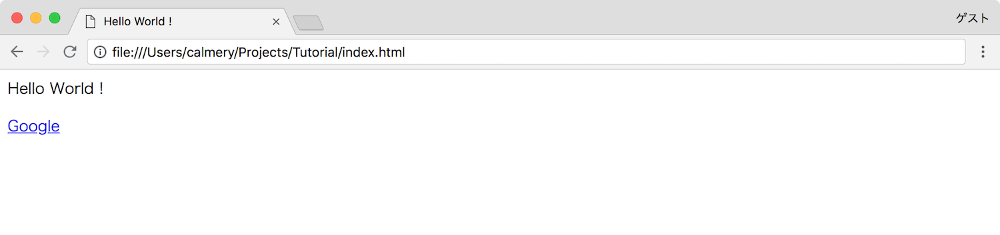

# タグ

HTML で使用されるタグについて説明します．

### タグとは？

タグは以下のような形で構成されます．これはタグの中の要素をグループ化する程度の理解で良いです．タグの入れ子も可能になっています．以下の例では `tag` というのがこのタグの名前，`content` という部分がこのタグの中身になります．

```html
<tag>content</tag>
```

### 解説

先ほど `index.html` に貼り付けた内容を説明していきます．

##### `html` タグ

まず HTML を構成する全てのタグは `html` というタグで囲まれている必要があります．これは HTML 文章であることを示すために必要です．

```html
<html></html>
```

##### `head` タグ

`head` タグは，その HTML に関する情報を記述するために使用します．例えばその HTML のタイトル，文字コードなどです．この `head` タグは `html` タグで囲まれている必要があります．

```html
<html>
  <head></head>
</html>
```

では `head` タグの中に HTML のタイトルを指定する `title` タグを入れてみます．

```html
<html>
  <head>
    <title>Hello World !</title>
  </head>
</html>
```

これでこの HTML のタイトルは「Hello World !」であると宣言することができました．

##### `body` タグ

`body` タグは画面に表示される HTML の内容について記述します．この `body` タグも `head` タグと同様に `html` タグで囲まれている必要があります．

```html
<html>
  <head>
    <title>Hello World !</title>
  </head>

  <body></body>
</html>
```

`body` タグの中に `p` タグを入れてみます．この `p` タグは中に指定した文字列を表示するために使用されるタグです．

```html
<html>
  <head>
    <title>Hello World !</title>
  </head>

  <body>
    <p>Hello World !</p>
  </body>
</html>
```

これで画面に「Hello World !」と表示することができるようになります．

> ##### 文字化けする
日本語の文字列を指定した際に文字化けしてしまう場合，`head` タグ内に `<meta charset="utf-8">` というタグを追加することで解消することができます．

### 複数のタグを使用する

このタグは複数同時に使用することができます．例えば，他のページへのリンクを追加したいという場合，以下のような形でリンクを追加することができます．

```html
<html>
  <head>
    <title>Hello World !</title>
  </head>

  <body>
    <p>Hello World !</p>
    <a href="https://www.google.com">Google</a>
  </body>
</html>
```

このコードを実行すると以下のように表示され，「Google」という文字列をクリックすると [Google](https://www.google.com) に遷移するようになります．



以下のように複数のリンクを追加することも可能です．

```html
<html>
  <head>
    <title>Hello World !</title>
  </head>

  <body>
    <p>Hello World !</p>
    <a href="https://www.google.com">Google</a>
    <a href="https://www.yahoo.co.jp">Yahoo</a>
  </body>
</html>
```

### オプションを追加する

リンクを追加した際に，これまでみてきたタグと異なる形のタグが出てきました．該当部分だけ取り出してみます．

```html
<a href="https://www.google.com">Google</a>
```

これはオプション付きのタグという解釈ができます．この `a` というタグは `href` というオプションを持ち，このオプションに `https://www.google.com` という値を渡すことでこの値へのリンクとすることができます．そしてこの `a` タグの中にある `Google` という文字列がこのリンクの対象となり，この文字列をクリックすると `https://www.google.com` に遷移するようになります．

タグによって指定できるオプションに差があり，`a` タグはリンクを指定するためのタグであるため `href` というオプションを持っています．先ほど出てきた `p` タグにはこの `href` というオプションはありません．
