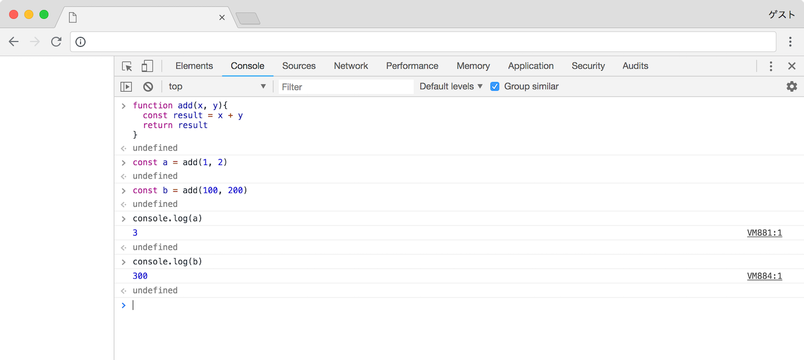

# 関数

関数は処理をまとめ，再利用可能にするという目的で使用されます．

### 関数を定義する

関数は以下のように定義することができます．

```javascript
function function_name(argument){
  statement1
  return statement2
}
```

`function` は関数を定義するために用意されたキーワードです．`function_name` で関数の名前を定義します．`argument` は引数と呼ばれ，その関数の中だけで有効な変数を定義することができます．関数名，引数名に関しては変数名と同じ扱いとなります．要は `0a` のように数値から始まる名前を関数名，引数名として使用することができません．

先ほど定義した関数は以下のように呼び出します．

```javascript
function_name(argument)
```

今まで使用してきた `console.log` も関数です．

```javascript
console.log('Hello World !')
```

### 値を返す

返り値とは関数の実行結果として返される値のことです．

```javascript
function add(x, y){
  const result = x + y
  return result
}

const a = add(1, 2)
const b = add(100, 200)

console.log(a)
console.log(b)
```

実行します．

```javascript
> function add(x, y){
...   const result = x + y
...   return result
... }
> const a = add(1, 2)
> const b = add(100, 200)
> console.log(a)
3
> console.log(b)
300
```



もし関数を使わずに同じ処理を記述したら以下のようになります．実行結果は同じになります．

```javascript
let x = 1
let y = 2
const a = x + y

let x = 100
let y = 200
const b = x + y

console.log(a)
console.log(b)
```

引数として渡された間の数値の合計値を返す関数を作ってみます．

```javascript
function sum(start, end){
  let result = 0
  for(let i=start; i<=end; i++){
    result = result + i  
  }
  return result  
}

console.log(sum(1, 10))
console.log(sum(100, 1000))
```

実行結果は以下のようになります．

```javascript
> function sum(start, end){
...   let result = 0
...   for(let i=start; i<=end; i++){
...     result = result + i  
...   }
...   return result  
... }
> console.log(sum(1, 10))
55
> console.log(sum(100, 1000))
495550
```

以上のように毎回ループを使用して求めることもできますが，関数を作ることで共通部分をまとめることができ簡単に再利用ができます．

> ##### 関数はどこで使うのか？
ゲーム上の移動の処理，右に移動する，左に移動するといった処理は座標を移動するという意味では同じ動作をします．そこで座標を移動するという機能を共通化し，関数にまとめます．これにより，この関数の引数に移動先の座標を渡しだけでプレイヤーはその場所に移動するといった処理が可能になります．

### 別の記法を使う

JavaScript の関数には複数の記述方法があります．以下にその例を示します．

```javascript
function add(x, y){
  const result = x + y
  return result
}

console.log(add(1, 2)) // 3
console.log(add(2, 3)) // 5
```

まずこれは先ほど説明した関数の定義方法です．以下の記述は無名関数，またアロー関数と呼ばれ，厳密な違いはありますが，動作だけを見ると全て先ほどの関数定義と同じです．

```javascript
const add = function(x, y){
  const result = x + y
  return result
}
```

```javascript
const add = (x, y) => {
  const result = x + y
  return result
}
```

```javascript
const add = (x, y) => {
  return x + y
}
```

```javascript
const add = (x, y) => x + y
```

もうひとつ例を示します．

```javascript
function double(x){
  return x * 2
}

function applyFive(f){
  return f(5)
}

console.log(applyFive(double)) // 10
```

ここで定義した `double` と `applyFive` という関数は以下のようにも定義することができます．

```javascript
const double = x => x * 2
const applyFive = f => f(5)

console.log(applyFive(double)) // 10
```

実行した結果は同じです．
