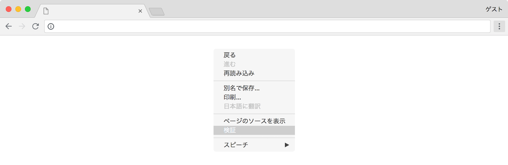

# Hello World !

[Google Chrome](https://www.google.co.jp/chrome/index.html) を開き，

画面を右クリックしてメニューを開き，検証をクリックします．



その後，`Console` というタブを開きます．これで JavaScript の実行環境が立ち上がりました．


ここで記述した JavaScript のプログラムはここで実行することができます．JavaScript の実行環境の起動が確認できたら以下のように入力してください．

```javascript
> console.log('Hello World !')
```

お馴染みの「Hello World !」という文字列を出力することができました．


簡単な計算などであればこの対話環境で十分に実行できます．

|演算子||
|:-|:-|
|+|加算|
|-|減算|
|*|乗算|
|/|除算（商）|
|%|除算（余り）|

```javascript
> console.log(2 + 2)
4
> console.log(2 - 2)
0
> console.log(2 * 2)
4
> console.log(2 / 2)
1
> console.log(2 % 2)
0
> console.log('Hello World !')
Hello World !
> console.log('Hello ' + 'World ' + '!')
Hello World !
```
