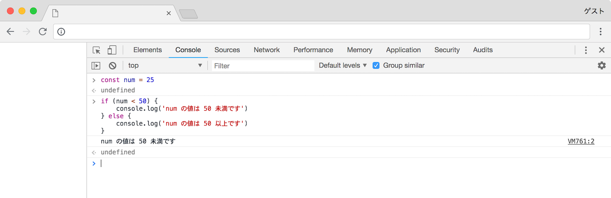
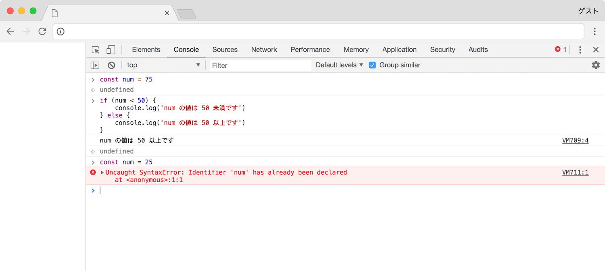

# 条件分岐

条件によって処理を分ける場合に使用します．

```javascript
if(condition){
  // condition が真のとき statement1 を実行する
  statement1
} else {
  // condition が偽のとき statement2 を実行する
  statement2  
}
```

条件には以下のような記述が可能です．

| 条件 | | 例 |  |
|:-|:-|:-|:-|
| == | 等しい | A == B | A と B は等しい |
| != | 等しくない | A != B | A と B は等しくない |
| >= | 以上（以下） | A >= B | A は B 以上 |
| <= | 以下（以上） | A <= B | A は B 以下 |
| > | 大きい（小さい） | A > B | A は B より大きい |
| < | 小さい（大きい） | A < B | A は B より小さい |

条件は以下の「または」や「かつ」を使用し同時に複数記述することができます．

| 条件 | | 例 |  |
|:-|:-|:-|:-|
| &#124;&#124; | または | A &#124;&#124; B | A または B が真である |
| && | かつ | A && B | A と B はどちらも真である |

複数の条件で分岐を行いたい場合は `else if` を使用します．

```javascript
if(condition1){
  // condition1 が真のとき statement1 を実行する
  statement1
} else if(condition2) {
  // condition1 が偽で condition2 が真のとき statement2 を実行する
  statement2
} else {
  // condition1 と condition2 が偽のとき statement3 を実行する
  statement3
}
```

`else` 節は省略することができます．このように，もし条件が真の場合にのみ処理を実行し，偽の場合に何も処理を行いたくないという場合にも条件分岐を使用できます．

```javascript
if(condition){
  // condition が真のとき statement1 を実行する
  statement1
}
```

> ##### 条件分岐はどこで使うのか？
例えばゲームを作るとします．プレイヤーを操作して，敵を倒していくようなゲームです．プレイヤーは止まる，歩く，攻撃するなどの状態を持ちます．このゲームの条件として，プレイヤーは歩いている最中に敵を攻撃することはできません．では，ここでプレイヤーが止まっているときに攻撃ボタンが押されたとします．この場合，プレイヤーは止まっているので攻撃できます．攻撃の処理に移ります．ですが，ここでもし歩いていた場合，歩いている場合は攻撃できないため，攻撃は行いません．

### 例

以下の例は定数である `num` を定義し，整数である `75` を代入します．この変数の値が `50` 未満のとき「num の値は 50 未満です」と出力し，それ以外のとき「num の値は 50 以上です」と出力します．

```javascript
const num = 75

if (num < 50) {
  console.log('num の値は 50 未満です')
} else {
  console.log('num の値は 50 以上です')
}
```

> `num` はこのプログラム中では再代入を行う予定はありません．そのため `let` を使用した変数ではなく `const` を使用した定数で定義しています．

実行します．

```javascript
> const num = 75
>
> if (num < 50) {
...   console.log('num の値は 50 未満です')
... } else {
...   console.log('num の値は 50 以上です')
... }
num の値は 50 以上です
```


`num` の値を `25` に変更して再び実行します．

```javascript
> const num = 25
>
> if(num < 50){
...   console.log('num の値は 50 未満です')
... } else {
...   console.log('num の値は 50 以上です')
... }
num の値は 50 未満です
```



正しく分岐していることがわかります．

> ##### `Uncaught SyntaxError: Identifier 'num' has already been declared` と表示される
これは `const` というキーワードで定数を定義しており，変数への値の再代入ができないため起こっています． 一度実行環境を抜け，再び実行環境に入り実行することで定義されていた定数が全て削除され，実行が可能になります．



二つ目の例として複数の条件を指定してみます．定数である `a` を用意します．この定数の値が `10` のとき「a の値は 10 です」を，`20` のとき「a の値は 20 です」を，それ以外のとき「a の値は 10 でも 20 でもありません」を出力します．

```javascript
const a = 10

if (a == 10) {
  console.log('a の値は 10 です')
} else if (a == 20 ) {
  console.log('a の値は 20 です')
} else {
  console.log('a の値は 10 でも 20 でもありません')
}
```

実行してみます．

```javascript
> const a = 10
> if (a == 10) {
...   console.log('a の値は 10 です')
... } else if (a == 20 ) {
...   console.log('a の値は 20 です')
... } else {
...   console.log('a の値は 10 でも 20 でもありません')
... }
a の値は 10 です
```

`a` の値を `15` に変更し，再び実行します．

```javascript
> const a = 10
> if (a == 10) {
...   console.log('a の値は 10 です')
... } else if(a == 20 ){
...   console.log('a の値は 20 です')
... } else {
...   console.log('a の値は 10 でも 20 でもありません')
... }
a の値は 10 でも 20 でもありません
```

処理を分岐することができました．

### 条件を指定する際の注意

JavaScript は良くも悪くも適当な記述で動作してしまう言語です．他言語では偽となる条件でも真となってしまう場合があります．以下にその例を示します．

```javascript
const num = 123
const str = '123'

if (num == str) {
  console.log('num と str の値が一致しました')
} else {
  console.log('num と str の値は一致しません')
}
```

このプログラムを実行すると以下のような結果が出力されます．

```javascript
> const num = 123
> const str = '123'
> if (num == str) {
...   console.log('num と str の値が一致しました')
... } else {
...   console.log('num と str の値は一致しません')
... }
num と str の値が一致しました
```

この例では `num` は数字の `123` で `str` は文字列の `123` です．見た目は同じであっても数字と文字列はそもそもの種類が異なるのでこの場合，真ではなく偽になるべきです．JavaScript には比較を行うための別の記述方法が用意されています．

```javascript
const num = 123
const str = '123'

if (num === str) {
  console.log('num と str の値が一致しました')
} else {
  console.log('num と str の値は一致しません')
}
```

`==` を `===` に置き換えました．実行します．

```javascript
> const num = 123
> const str = '123'
> if (num === str) {
...   console.log('num と str の値が一致しました')
... } else {
...   console.log('num と str の値は一致しません')
... }
num と str の値は一致しません
```

一致しないという結果が得られました．このように数字は数字としか一致せず，文字列は文字列としか一致しないというような厳密に比較を行いたい場合，`==` ではなく `===` を使用します．また `!=` にも `!==` という別の記述方法が用意されています．
