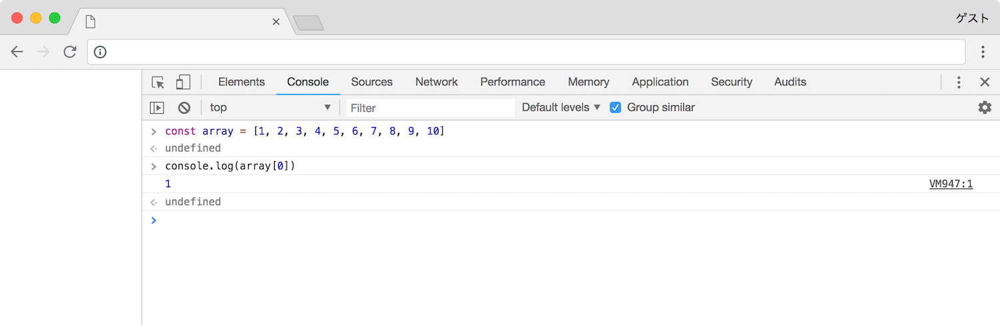
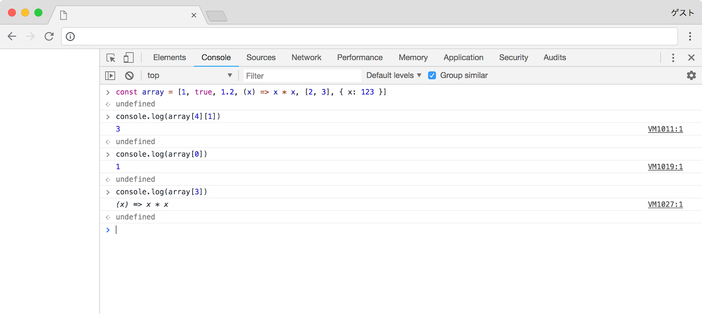

# オブジェクト

オブジェクトはデータをまとめて持つという目的で使用されます．変数では単一の値，例えば `123` などの値を持つことができましたが，オブジェクトでは例えば `123` と `987` といった複数の値をまとめて持つことができます．

### 配列

配列は値の集合です．

```javascript
[123, 987]
```

`[` と `]` で囲まれており，`,` で値の区切りを示します．

##### 値の個数

個数に制限はありません．

```javascript
[1, 2, 3, 4, 5, 6, 7, 8, 9, 10]
```

##### 値の参照

配列は変数，または定数へ代入し参照することができます．

```javascript
const array = [1, 2, 3, 4, 5, 6, 7, 8, 9, 10]

console.log(array[0])
```

実行します．

```javascript
> const array = [1, 2, 3, 4, 5, 6, 7, 8, 9, 10]
> console.log(array[0])
1
> console.log(array[1])
2
> console.log(array[9])
10
> console.log(array[10])
undefined
```

配列は添字と呼ばれるキーワードを使用して値を参照することができます．ここでは `array` という定数へ配列を代入しており，その `array` に添字である `[0]` と付けることで配列の最初の値である `1` を参照することができています．



> 添字は `0` から始まる点に注意が必要です．

##### 値の種類

また，中の値の種類にも制限はありません．数値と文字列を同時に持つことも可能となっています．ですが，配列は単一の種類の値のみを保持するべきでこれは推奨されません．

```javascript
const array = [1, true, 1.2, (x) => x * x, [2, 3], { x: 123 }]

console.log(array[4][1]) // 3
console.log(array[0]) // 1
console.log(array[3]) // (x) => x * x (アロー関数)
```



> ##### 配列はどこで使うのか？
配列は多次元配列といって配列の中に配列を入れるということが可能になっています．これを使用して `x` と `y` という軸を持つ 2D のゲームのマップを再現することが可能になります．

### 連想配列

連想配列はその名の通り，連想できる配列です．先ほど説明した配列では添字として `0` や `1`，`10` などを使用しましたが連想配列では特定の値を使用することができます．以下に例を示します．

```javascript
{
  x: 1,
  y: 2  
}
```

連想配列も配列と同様に変数，または定数に代入して参照することができます．

```javascript
const object = {
  x: 1,
  y: 2  
}

console.log(object['x'])
console.log(object['y'])
```

実行します．

```javascript
> const object = {
...   x: 1,
...   y: 2  
... }
> console.log(object['x'])
1
> console.log(object['y'])
2
```

値を参照できました．


##### 複雑な連想配列

連想配列も配列と同様に連想配列の中に連想配列を入れるということが可能になっています．以下に例を示します．

```javascript
const object = {
  message: 'Hello World',
  profile: {
    name: 'Diarmait Mac Craith',
    age: 20
  }
}

console.log(object['message']) // Hello World
console.log(object['profile']['age']) // 20
```

実行します．

```javascript
> const object = {
...   message: 'Hello World',
...   profile: {
...     name: 'Diarmait Mac Craith',
...     age: 20
...   }
... }
> console.log(object['message'])
Hello World
> console.log(object['profile']['age'])
20
```


> ##### 連想配列はどこで使うのか？
例えばゲームのプレイヤーを考えてみます．プレイヤーには名前，体力，性別などが存在しますが，それらを複数の変数で管理すると `playerName` や `playerHP` など，使用する変数が増えて管理が大変になります．複数の変数ではなくプレイヤーに関する値をまとめるひとつの変数 `player` を定義し，連想配列を使用して `player['name']` や `player['hp']` のような形にすることで管理が容易になります．

##### 値の参照

連想配列の添字は以下のような記述でも値を参照することができる．一般的に連想配列の値の参照にはこちらを用いる．

```javascript
const object = {
  message: 'Hello World',
  profile: {
    name: 'Diarmait Mac Craith',
    age: 20
  }
}

console.log(object.message) // Hello World
console.log(object.profile.age) // 20
```


