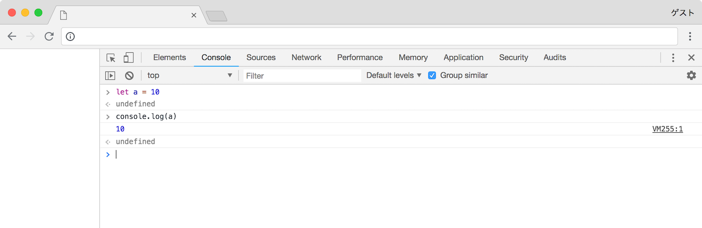
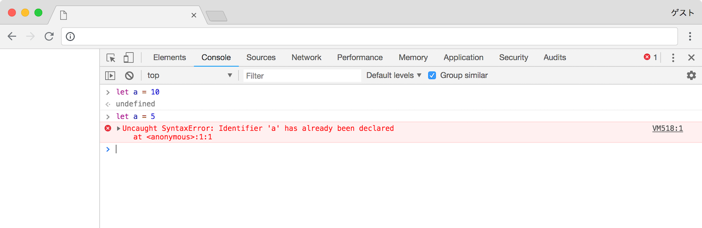

# 変数

変数は値に付けるラベルのことです．

### 変数を定義する

以下の例では `10` という値に `a` というラベルを付けています．今後，このプログラム上では `a` というラベルは `10` という値を指すことになり，この操作を変数の定義，宣言，または代入といいます．

変数の定義には `let` というキーワードを使用します．この場合，`a` という変数を定義するために `a` の前に `let` というキーワードを付けています．

```javascript
let a = 10
```

対話環境で実行すると `10` が表示されます．

```javascript
> let a = 10
> console.log(a)
10
```




> ##### `var` について
JavaScript のサンプルコードなどを見ていると `var` というキーワードを目にするかもしれません．これは以前使用されていた変数を定義するためのキーワードで今は `let` を使用することが推奨されています．厳密に言えば違いがありますが，初めは意識せず `var` は `let` に置き換えて考えるようにしてください．


### 変数を扱う

以下は変数の扱い方の例です．ここでは変数を利用して値の加算を行っています．以下の例では `a` は `10` を指します．そして `b` は `a + 5` と定義されています．実行すると `b` は `15` という値を指すことになります．

```javascript
let a = 10
let b = a + 5
```

実行してみます．

```javascript
> let a = 10
> let b = a + 5
> console.log(b)
15
```


### 変数名について

変数の名前に使用できる文字にはいくつかの制限があります．まず，変数名にはアルファベットと数字，アンダースコアしか使用することができません．そして，必ず数字以外の文字から始める必要があります．長さには制限がありませんが簡潔でわかりやすい名前を付けることが推奨されます．

> ##### なぜ数値から始めることができないのか？
JavaScript では普段私たちが使用している 10 進法だけでなく 16 進法など他の進法にも対応しています．そして，それら進法を記述する際には，0xfff のような特殊な記述方法を使用します．もし変数名を数字から始めると，これらは区別することができないのです．

##### 良い例

`a` や `Ab_C01` といった文字列は変数名として使用可能です．

```javascript
> let Ab_C01 = 20
> console.log(Ab_C01)
20
```

##### 悪い例

`0a` や `1111` は悪い例です．この例では，良い例と違い `Uncaught SyntaxError: Invalid or unexpected token` というエラーが起こりました．

```bash
> let 0a = 10
Uncaught SyntaxError: Invalid or unexpected token
```


### 値を再代入する

変数が持つ値は定義後でも上書きすることができます．以下の例では `b` には `15` という値が代入され `c` には `25` という値が代入されます．再代入の際には `let` は必要ありません．`let` は未定義の変数を定義するために使用し，定義済みの変数には必要ありません．

```javascript
let a = 10
let b = a + 5

a = 5
let c = a + 20
```

実行します．

```javascript
> let a = 10
> let b = a + 5
> console.log(a)
10
> console.log(b)
15
> a = 5
> let c = a + 20
> console.log(a)
5
> console.log(c)
25
```

再代入の際に `let` を付けると `Uncaught SyntaxError: Identifier 'a' has already been declared` というエラーが発生します．

```javascript
> let a = 10
> let a = 5
Uncaught SyntaxError: Identifier 'a' has already been declared
```



ラベルを付け替えるというイメージを持つと理解しやすいと思います．

### 定数について

これは JavaScript だけでなく他の言語にも言えることですが，再代入の可能性がない変数に関しては定数に置き換えることが推奨されます．理由として，変数は再代入が可能であるため意図しない形で値が変更される可能性があり，不具合を生み出す原因となるためです．

定数の定義には `let` ではなく `const` というキーワードを使用します．変数との差はこのキーワードと再代入ができない点のみで他は同じように扱うことができます．

```javascript
> const a = 10
> const b = a + 5
> console.log(a)
15
```

再代入を行おうとすると `Uncaught TypeError: Assignment to constant variable.` というエラーが発生します．

```javascript
> const a = 10
> const b = a + 5
> console.log(a)
10
> console.log(b)
15
> a = 5
Uncaught TypeError: Assignment to constant variable.
> const c = a + 20
> console.log(a)
10
> console.log(c)
30
```


